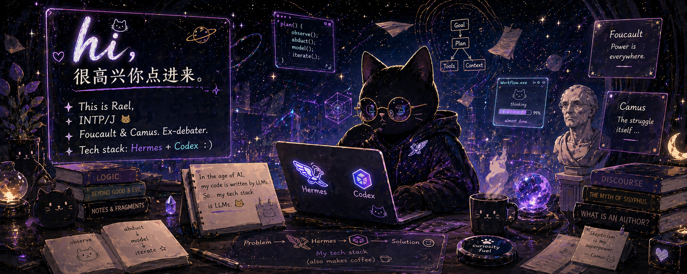

# Rael · realraelrr

  INTP/J. Cat loyalist. Navigating the absurd with Camus and deconstructing systems with Foucault.
  Recovering debater now orchestrating AI workflows via Hermes + Codex.

  <a href="https://github.com/realraelrr?tab=repositories">Projects</a>
  ·
  <a href="https://github.com/realraelrr/idlepilot-agent">IdlePilot Agent</a>
  ·
  <a href="https://github.com/realraelrr/docling-skill">Docling Skill</a>

---

### Tech Stack: Vibe Coding

Let's be honest: my primary programming languages are English and structured prompting. I don't maintain a rigid list of frameworks.

**My tech stack is whatever my LLM agents decide is best for the job today.** I provide the first principles, the architectural constraints, and the Occam's Razor ruthlessness. The agents, mostly Hermes + Codex, write the boilerplate. I do the code review, herd the autonomous workflows, argue with vision models when they hallucinate, and pay the API bills.

---

### The Workflow

My default loop is building systems that can survive contact with reality.

- **Hermes** handles memory, routing, and workflow continuity, often wrangling multi-agent topologies.
- **Codex** handles focused implementation, verification, and aggressive codebase edits.

I prefer tools with a lo-fi aesthetic, local-first data pipelines, clear failure modes, and enough observability that I can intervene when an agent inevitably goes rogue.

---

### Featured Automations

| Project | What the Agents Built (Mostly) |
|---|---|
| **[idlepilot-agent](https://github.com/realraelrr/idlepilot-agent)** | AI ops agent for marketplace customer service, expert routing, bargaining, and runtime recovery. Built for real-world chaos. |
| **[docling-skill](https://github.com/realraelrr/docling-skill)** | Agent-first PDF ingestion layer with Markdown, image sidecars, OCR, and strict quality gating. |
| **[hermes-gateway-watchdog](https://github.com/realraelrr/hermes-gateway-watchdog)** | macOS watchdog to keep Hermes gateway and Cloudflare tunnels alive while I sleep. |
| **[openclaw-gateway-watchdog](https://github.com/realraelrr/openclaw-gateway-watchdog)** | Tooling to enforce stability on the OpenClaw gateway. |

---

  <i>"Simple enough to work, complex enough to be interesting."</i>

