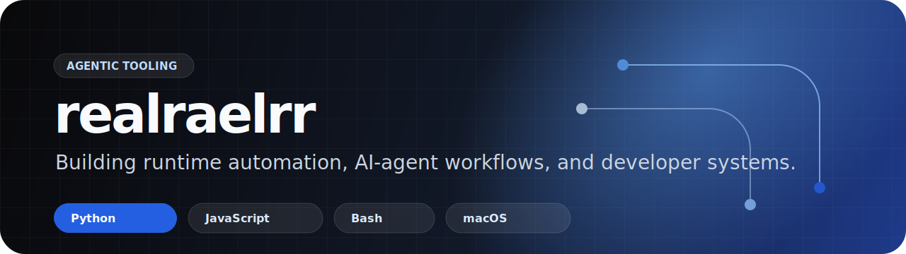

# Rael · realraelrr

  INTP building agentic tools, runtime automation, and AI workflows with Hermes agent + Codex.

  <a href="https://github.com/realraelrr?tab=repositories">Projects</a>
  ·
  <a href="https://github.com/realraelrr/idlepilot-agent">IdlePilot Agent</a>
  ·
  <a href="https://github.com/realraelrr/docling-skill">Docling Skill</a>

---

### Focus

I build practical AI-agent infrastructure and automation tools. Off the keyboard, I am a cat person, a reader of Foucault and Camus, and a Chinese-language debater from the university campus circuit.

- Agent runtime workflows
- Hermes agent + Codex workflows
- Developer productivity systems
- PDF and document ingestion pipelines
- Gateway, watchdog, and recovery tooling
- Small, reliable tools that are easy to run and inspect

---

### AI Workflow

My default working loop is `Hermes agent + Codex`: Hermes carries memory, routing, and workflow continuity; Codex handles focused implementation, verification, and codebase edits.

I like workflows that can think in systems and still survive contact with reality: clear handoff state, reproducible commands, observable recovery paths, and enough room for a good argument.

---

### Featured Work

| Project | What it does | Stack |
|---|---|---|
| [idlepilot-agent](https://github.com/realraelrr/idlepilot-agent) | AI operations agent for marketplace customer service, expert routing, bargaining, and runtime recovery | Python |
| [docling-skill](https://github.com/realraelrr/docling-skill) | Agent-first PDF ingestion layer with Markdown, image sidecars, OCR, and quality gating | Python |
| [hermes-gateway-watchdog](https://github.com/realraelrr/hermes-gateway-watchdog) | Standalone macOS watchdog for Hermes gateway and Cloudflare tunnel health | Bash / JavaScript |
| [openclaw-gateway-watchdog](https://github.com/realraelrr/openclaw-gateway-watchdog) | Watchdog tooling for OpenClaw gateway stability | JavaScript |

---

### Working Style

- Prefer small tools with clear failure modes
- Verify behavior with real commands, not assumptions
- Keep automation observable and recoverable
- Optimize for local-first workflows and agent handoff

---

### Tech

  
  
  
  
  
  

---

### Profile Setup Notes

For the full effect, set these GitHub profile fields manually after publishing this repository:

- Name: `Rael`
- Bio: `Building AI workflows with Hermes agent + Codex.`
- Website: your personal site if you want one public
- Pinned repositories: `idlepilot-agent`, `docling-skill`, `hermes-gateway-watchdog`, `openclaw-gateway-watchdog`
