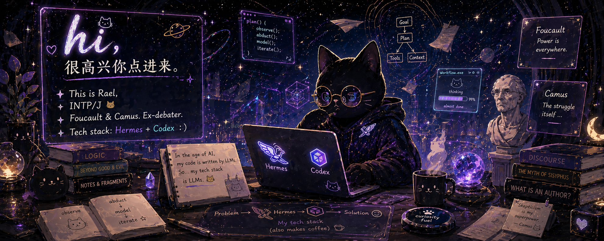

# Rael · realraelrr

INTP. Camus & Foucault enjoyer. AI native coding, agent infrastructure, and harness engineering — the scaffolding that keeps agents useful after the demo ends.

Preferred harness: Codex. Occasional companion: Hermes agent.

---

### What I'm Building

Every project here answers the same question: **what breaks when you try to run agents for real?**

**Document Ingestion** — agents can't read PDFs without hallucinating

- [docling-skill](https://github.com/realraelrr/docling-skill) — Manifest-based quality gating so the agent knows what's actually ready before it starts guessing. 4 releases, multi-OCR backends, Claude Code + Codex.

**Agent Output** — agents produce Markdown, humans need something readable

- [md-for-human](https://github.com/realraelrr/md-for-human) — Deterministic renderer: Markdown in, navigable HTML site out. The source stays clean, the artifact is disposable. Has a `--verify` flag and it's not afraid to use it.

**Business Agent** — a digital employee, not just a chatbot

- [knot-agent](https://github.com/realraelrr/knot-agent) + [knot-skills](https://github.com/realraelrr/knot-skills) — Prototype for an enterprise digital worker: local-first workspace, durable knowledge, reusable skills, and multi-channel, multi-user communication. The target is an agent that can exist inside a company as an independent operating role.

**Infrastructure** — agents that don't crash, because I taught them not to

- [hermes-gateway-watchdog](https://github.com/realraelrr/hermes-gateway-watchdog) — Gateway + Cloudflare tunnel health monitor with staged recovery.
- [openclaw-gateway-watchdog](https://github.com/realraelrr/openclaw-gateway-watchdog) — Same pattern, different gateway. Cold-start tolerance so it doesn't mistake "waking up" for "dead."
- [watchdog-command-receiver](https://github.com/realraelrr/watchdog-command-receiver) — Feishu IM command receiver. No public URL, no shell, audit-logged. Poke your infra from your phone.

---

> **The goal is not to make agents look magical. The goal is to make them useful, inspectable, and boring enough to trust.**

*"Simple enough to work, complex enough to be interesting."*
